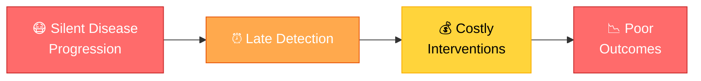

<div align="center">

# 🏥 𝐂𝐥𝐢𝐧𝐢𝐜𝐚𝐥 𝐑𝐢𝐬𝐤 𝐏𝐫𝐞𝐝𝐢𝐜𝐭𝐨𝐫

### *Transforming Healthcare Through AI-Powered Preventive Medicine*

[](https://github.com)
[](https://github.com)
[](https://github.com)
[](LICENSE)

**A Praxis 2.0 Submission: GenAI + Machine Learning Innovation Showcase**

*Healthcare | Preventive Medicine | Human-AI Collaboration*

---

<p align="center">
  
  
  
  
  
</p>

</div>

---

## 📑 Table of Contents

- [🏆 Praxis 2.0 Overview](#-praxis-20-overview)
- [🎯 Problem Statement](#-problem-statement)
- [💡 Solution Architecture](#-solution-architecture)
- [🚀 Key Features](#-key-features)
- [🛠️ Tech Stack](#️-tech-stack)
- [👥 Team Structure](#-team-structure)
- [📅 Development Timeline](#-development-timeline)
- [⚡ Quick Start](#-quick-start)
- [📦 Project Structure](#-project-structure)
- [📊 Expected Deliverables](#-expected-deliverables)
- [🎓 Evaluation Criteria](#-evaluation-criteria)
- [📚 Documentation](#-documentation)
- [🤝 Contributing](#-contributing)
- [📄 License](#-license)

---

## 🏆 Praxis 2.0 Overview

<table>
<tr>
<td width="33%" align="center">

<h3>🤖 Machine Learning</h3>
<p><i>Advanced risk prediction and patient stratification</i></p>
</td>
<td width="33%" align="center">

<h3>✨ Generative AI</h3>
<p><i>Intelligent reasoning and natural language insights</i></p>
</td>
<td width="33%" align="center">

<h3>👥 Human-Centric</h3>
<p><i>Clinical relevance and usability first</i></p>
</td>
</tr>
</table>

**Praxis 2.0** is a GenAI + Machine Learning innovation showcase where we design and build functional prototypes addressing real-world challenges. This project demonstrates:

> 🎯 **Machine Learning** for risk prediction and stratification  
> 🧠 **Generative AI** for reasoning, explanation, and patient-friendly insights  
> 💚 **Human-Centric Design** prioritizing clinical relevance and usability

---

## 🎯 Problem Statement

### 🏥 Track 1: Clinical Decision Support

<div align="center">



</div>

#### 🔍 Context

Chronic diseases such as **diabetes** often develop silently. By the time symptoms appear, interventions become costly and outcomes worsen. Clinicians operate under:

- ⏱️ **Time Pressure** — Limited consultation windows
- 📊 **Data Gaps** — Incomplete historical records  
- ❓ **Uncertainty** — Complex probabilistic assessments

Meanwhile, **patients struggle** to understand probabilistic health risks and preventive actions.

#### ⚠️ The Challenge

> **Design a clinical decision support workflow that:**
> - ✅ Surfaces early risk signals from routine patient data
> - ✅ Supports informed, timely interventions
> - ✅ Doesn't overwhelm doctors or mislead patients

#### 💡 What Our Solution Enables

<table>
<tr>
<td width="50%">
<h4>🔬 For Clinicians</h4>
<ul>
<li>📈 High-density risk scores with confidence intervals</li>
<li>🎯 Key contributing factors ranked by importance</li>
<li>📊 SHAP-based explanations and visualizations</li>
<li>💊 Evidence-based action recommendations</li>
<li>📉 Longitudinal trend analysis</li>
</ul>
</td>
<td width="50%">
<h4>👤 For Patients</h4>
<ul>
<li>🚦 Simple risk gauges (traffic light system)</li>
<li>📝 Plain-language summaries</li>
<li>🥗 Personalized lifestyle guidance</li>
<li>📱 Progress tracking over time</li>
<li>✨ AI-generated action plans</li>
</ul>
</td>
</tr>
</table>

---

## 💡 Solution Architecture

### 🏗️ System Design

<div align="center">


</div>

### 🔄 Data Flow Pipeline

<div align="center">


</div>

---

## 🚀 Key Features

### 🎯 Core Capabilities

<table>
<tr>
<td width="50%">

#### 1️⃣ Risk Scoring & Stratification

- 📊 **Multi-Level Classification**: Low / Medium / High risk tiers
- 📈 **Confidence Intervals**: Uncertainty quantification
- 📉 **Longitudinal Tracking**: Risk velocity over time
- 🎯 **Percentile Rankings**: Population-based context

</td>
<td width="50%">

#### 2️⃣ Explainability & Transparency

- 🔍 **SHAP Values**: Feature importance rankings
- 📊 **Force Plots**: Visual explanation of predictions
- 🎨 **Interactive Charts**: Drill-down analysis
- 📋 **Audit Trails**: Complete decision logs

</td>
</tr>
<tr>
<td width="50%">

#### 3️⃣ Counterfactual Reasoning

- 🎛️ **What-If Scenarios**: "Reduce BMI by 5% → Risk ↓15%"
- 🔄 **Interactive Simulation**: Real-time slider controls
- 🎯 **Modifiable Factors**: Focus on actionable changes
- 📈 **Impact Visualization**: Before/after comparisons

</td>
<td width="50%">

#### 4️⃣ AI-Powered Reports

- 📝 **Clinical Summaries**: Technical detail for providers
- 👤 **Patient Explanations**: Plain-language versions
- 🤖 **BioMistral-7B**: Medical-grade language model
- 📄 **PDF Generation**: Exportable reports

</td>
</tr>
<tr>
<td width="50%">

#### 5️⃣ Population Analytics

- 👥 **Digital Twin Matching**: Find similar patient outcomes
- 📊 **Cohort Analysis**: Demographic comparisons
- 🎯 **Percentile Context**: "Your risk is higher than 82% of peers"
- 📈 **Trend Detection**: Population-level patterns

</td>
<td width="50%">

#### 6️⃣ Safety & Guardrails

- ⚖️ **Bias Detection**: Demographic fairness checks
- ❓ **Uncertainty Estimates**: Model confidence scores
- ✅ **Clinical Validation**: Rule-based sanity checks
- 📋 **Limitation Disclaimers**: Transparent boundaries

</td>
</tr>
</table>

---

## 🛠️ Tech Stack

<div align="center">

### Backend Stack


### Frontend Stack


### ML & AI Stack


### DevOps & Tools


</div>

### 📊 Technology Matrix

| Layer | Technology | Purpose |
|:------|:-----------|:--------|
| 🎨 **Frontend** | React + TypeScript | Interactive UI components |
| 🎨 **Styling** | Tailwind CSS | Responsive design system |
| ⚡ **Backend** | FastAPI | High-performance REST API |
| 🧠 **ML Engine** | XGBoost + LightGBM + CatBoost | SOTA ensemble prediction |
| 🔍 **Explainability** | SHAP | Feature importance analysis |
| 🤖 **AI Engine** | BioMistral-7B | Medical language model |
| 💾 **Database** | JSON Store (MVP) → PostgreSQL | Patient history & records |
| 🐳 **Container** | Docker + Docker Compose | Consistent deployment |
| 🚀 **Deployment** | Render (Backend) + Vercel (Frontend) | Cloud hosting |

---

## 👥 Team Structure

<div align="center">

### 🎯 4-Member Multidisciplinary Team

</div>

<table>
<tr>
<td width="50%">

### 🔬 ML Engineer
**Model Development & Explainability**

#### 🎯 Responsibilities
- 📊 Dataset cleaning and exploratory data analysis
- 🤖 Risk model development (XGBoost, LightGBM, CatBoost)
- 📈 Uncertainty quantification and calibration
- 🔍 SHAP-based feature importance
- 🎲 Counterfactual reasoning implementation
- ⚖️ Bias detection and fairness analysis

#### 📦 Deliverables
- `ml-research/train.py` — Model training pipeline
- `backend/models/risk_model.py` — Inference engine
- `backend/models/explainability.py` — SHAP integration
- Model performance reports and visualizations

</td>
<td width="50%">

### ⚙️ Backend Engineer
**FastAPI Services & Infrastructure**

#### 🎯 Responsibilities
- 🏗️ API architecture and endpoint design
- 📥 Patient data ingestion and validation
- 🔐 Authentication and authorization
- 📊 Risk computation API endpoints
- 👥 Cohort analysis and digital twin matching
- 🚀 Deployment setup (Docker, Render)

#### 📦 Deliverables
- `backend/app.py` — Main FastAPI application
- `backend/routes/` — All API endpoints
- `backend/schemas/` — Pydantic models
- API documentation (OpenAPI/Swagger)

</td>
</tr>
<tr>
<td width="50%">

### 👨‍⚕️ Frontend Engineer (Clinician)
**Professional Dashboard Interface**

#### 🎯 Responsibilities
- 🎨 Clinician dashboard UI/UX design
- 🔍 Patient search and filtering system
- 📊 Risk score visualization (gauges, charts)
- 🎯 Key driver display components
- 📋 Explanation panels and tooltips
- 💊 Action recommendation interface

#### 📦 Deliverables
- `frontend/src/components/Clinician/` — Dashboard components
- Risk visualization library
- Clinical workflow integration
- Responsive design implementation

</td>
<td width="50%">

### 👤 Frontend Engineer (Patient)
**Patient Portal & Documentation**

#### 🎯 Responsibilities
- 🎨 Patient portal UI/UX design
- 🚦 Simple risk gauge (traffic light)
- 📝 Plain-language explanation generation
- 🥗 Lifestyle recommendation interface
- 📈 Progress tracking visualizations
- 📚 Project documentation and pitch deck

#### 📦 Deliverables
- `frontend/src/components/Patient/` — Patient components
- User-friendly health guidance interface
- `docs/` — Comprehensive documentation
- Presentation slides and demo materials

</td>
</tr>
</table>

---

## 📅 Development Timeline

<div align="center">

### 🎯 Sprint to Submission — February 10 Deadline

</div>


### 📋 Detailed Sprint Plan

#### 🗓️ Week 1: Design & Core Model (by Jan 24)

<details>
<summary>🎯 Click to expand tasks</summary>

- [ ] **Project Setup**
  - [ ] Initialize GitHub repository with proper structure
  - [ ] Set up development environments (Python, Node.js)
  - [ ] Configure CI/CD pipelines (GitHub Actions)
  - [ ] Create project board and issue templates

- [ ] **ML Foundation**
  - [ ] Load and explore diabetes dataset
  - [ ] Perform statistical analysis and visualization
  - [ ] Handle missing values and outliers
  - [ ] Feature engineering (interactions, scaling)
  - [ ] Initial model prototyping

- [ ] **Backend Architecture**
  - [ ] Design API schema (Pydantic models)
  - [ ] Set up FastAPI boilerplate
  - [ ] Implement health check endpoints
  - [ ] Configure CORS and middleware

- [ ] **Frontend Design**
  - [ ] Create wireframes for clinician dashboard
  - [ ] Design patient portal mockups
  - [ ] Set up React + TypeScript + Vite
  - [ ] Implement component structure

</details>

#### 🗓️ Week 2: Full Stack Development (by Jan 31)

<details>
<summary>🎯 Click to expand tasks</summary>

- [ ] **ML Pipeline**
  - [ ] Train ensemble model (XGBoost + LightGBM + CatBoost)
  - [ ] Implement SHAP explainability
  - [ ] Calculate feature importance
  - [ ] Serialize models (.joblib files)
  - [ ] Validate model performance (AUC-ROC, calibration)

- [ ] **Backend APIs**
  - [ ] `/predict` — Risk assessment endpoint
  - [ ] `/simulate` — What-if analysis endpoint
  - [ ] `/report` — AI report generation endpoint
  - [ ] `/history` — Patient timeline endpoint
  - [ ] `/cohort` — Population analysis endpoint

- [ ] **Frontend Integration**
  - [ ] Clinician dashboard with risk visualization
  - [ ] Patient portal with simple gauges
  - [ ] Connect to backend APIs
  - [ ] Implement state management
  - [ ] Add loading states and error handling

- [ ] **End-to-End Testing**
  - [ ] Integration tests for API endpoints
  - [ ] UI component tests
  - [ ] Full workflow validation

</details>

#### 🗓️ Week 3: Polish & Submission (by Feb 9)

<details>
<summary>🎯 Click to expand tasks</summary>

- [ ] **Advanced Features**
  - [ ] Implement counterfactual engine
  - [ ] Add cohort comparison functionality
  - [ ] Integrate BioMistral-7B for AI reports
  - [ ] Build what-if simulation interface

- [ ] **Documentation**
  - [ ] Write comprehensive README
  - [ ] Create MODEL_CARD.md
  - [ ] Document ETHICS_AND_LIMITATIONS.md
  - [ ] Complete ARCHITECTURE.md
  - [ ] Generate API documentation

- [ ] **Presentation**
  - [ ] Design pitch deck (15 slides)
  - [ ] Record demo video (5-7 minutes)
  - [ ] Prepare talking points
  - [ ] Rehearse presentation

- [ ] **Final Polish**
  - [ ] UI/UX refinement and accessibility
  - [ ] Performance optimization
  - [ ] Bug fixes and edge case handling
  - [ ] Docker deployment testing
  - [ ] Submit repository and materials

</details>

---

## ⚡ Quick Start

### 📋 Prerequisites

```bash
# Required software
✅ Python 3.10+
✅ Node.js 18+
✅ Git 2.30+
✅ Docker 24.0+ (optional)
```

### 🐍 Backend Setup

```bash
# Navigate to backend directory
cd backend

# Create virtual environment
python -m venv venv

# Activate virtual environment
source venv/bin/activate  # On Windows: venv\Scripts\activate

# Install dependencies
pip install -r requirements.txt

# Run the server
uvicorn backend.api:app --reload --port 8001

# 🎉 Server running at http://localhost:8001
# 📚 API docs at http://localhost:8001/docs
```

### ⚛️ Frontend Setup

```bash
# Navigate to frontend directory
cd frontend

# Install dependencies
npm install

# Start development server
npm run dev

# 🎉 App running at http://localhost:5173
```

### 🧠 ML Model Training

```bash
# Navigate to ML research directory
cd ml-research

# Install dependencies
pip install -r requirements.txt

# Train the model
python train_pro.py

# 📦 Models saved to backend/models/
# 📊 Performance metrics in outputs/
```

### 🐳 Docker Deployment (Recommended)

```bash
# Build and run all services
docker-compose up --build

# Services available at:
# 🎨 Frontend: http://localhost:3000
# ⚡ Backend: http://localhost:8001
# 📚 API Docs: http://localhost:8001/docs
```

---

## 📦 Project Structure

```
clinical-risk-predictor/
│
├── 📁 backend/                     # FastAPI Server
│   ├── 📄 app.py                   # Main application entry point
│   ├── 📄 requirements.txt         # Python dependencies
│   │
│   ├── 📁 models/                  # ML Risk Models
│   │   ├── 📄 risk_model.py        # Ensemble prediction engine
│   │   ├── 📄 counterfactuals.py   # What-if analysis logic
│   │   └── 📄 explainability.py    # SHAP feature importance
│   │
│   ├── 📁 routes/                  # API Endpoints
│   │   ├── 📄 patient.py           # Patient data management
│   │   ├── 📄 risk.py              # Risk computation APIs
│   │   └── 📄 cohort.py            # Population analytics
│   │
│   ├── 📁 schemas/                 # Data Validation
│   │   ├── 📄 patient.py           # Patient data models
│   │   └── 📄 prediction.py        # Prediction schemas
│   │
│   └── 📁 utils/                   # Helper Functions
│       ├── 📄 preprocessing.py     # Feature engineering
│       └── 📄 validation.py        # Data validation
│
├── 📁 frontend/                    # React Application
│   ├── 📄 package.json             # Node dependencies
│   ├── 📄 vite.config.ts           # Vite configuration
│   │
│   ├── 📁 public/                  # Static Assets
│   │   └── 🖼️ logo.svg
│   │
│   └── 📁 src/
│       ├── 📄 App.tsx              # Root component
│       ├── 📄 main.tsx             # Entry point
│       │
│       ├── 📁 components/          # React Components
│       │   │
│       │   ├── 📁 Clinician/       # Doctor Dashboard
│       │   │   ├── 📄 RiskDashboard.tsx
│       │   │   ├── 📄 PatientList.tsx
│       │   │   ├── 📄 RiskDetail.tsx
│       │   │   └── 📄 CohortAnalysis.tsx
│       │   │
│       │   ├── 📁 Patient/         # Patient Portal
│       │   │   ├── 📄 RiskGauge.tsx
│       │   │   ├── 📄 SimpleReport.tsx
│       │   │   ├── 📄 ActionPlan.tsx
│       │   │   └── 📄 Progress.tsx
│       │   │
│       │   └── 📁 Common/          # Shared Components
│       │       ├── 📄 Header.tsx
│       │       ├── 📄 Footer.tsx
│       │       └── 📄 LoadingSpinner.tsx
│       │
│       ├── 📁 pages/               # Page Components
│       │   ├── 📄 ClinicianView.tsx
│       │   └── 📄 PatientView.tsx
│       │
│       ├── 📁 hooks/               # Custom Hooks
│       │   └── 📄 useRiskPrediction.ts
│       │
│       └── 📁 utils/               # Utilities
│           └── 📄 api.ts           # API client
│
├── 📁 ml-research/                 # ML Development
│   ├── 📄 train.py                 # Model training script
│   ├── 📄 evaluate.py              # Model evaluation
│   ├── 📄 requirements.txt         # ML dependencies
│   │
│   ├── 📁 notebooks/               # Jupyter Notebooks
│   │   ├── 📓 01_EDA.ipynb         # Exploratory analysis
│   │   ├── 📓 02_Modeling.ipynb    # Model development
│   │   └── 📓 03_Evaluation.ipynb  # Performance analysis
│   │
│   └── 📁 experiments/             # Experiment Logs
│       └── 📄 model_metrics.json
│
├── 📁 data/                        # Datasets
│   ├── 📊 diabetes_dataset.csv     # Training data (provided)
│   ├── 📊 synthetic_patients.csv   # Test data
│   └── 📊 population_stats.json    # Cohort statistics
│
├── 📁 docs/                        # Documentation
│   ├── 📄 ARCHITECTURE.md          # System design details
│   ├── 📄 API_SPEC.md              # API documentation
│   ├── 📄 MODEL_CARD.md            # Model specifications
│   ├── 📄 ETHICS_AND_LIMITATIONS.md # Safety considerations
│   ├── 📄 TEAM_ROLES.md            # Team structure
│   ├── 📄 TIMELINE.md              # Sprint planning
│   └── 📄 DEPLOYMENT.md            # Deployment guide
│
├── 📁 .github/                     # GitHub Configuration
│   └── 📁 workflows/
│       ├── 📄 backend-tests.yml    # Backend CI/CD
│       └── 📄 frontend-tests.yml   # Frontend CI/CD
│
├── 📄 docker-compose.yml           # Multi-container setup
├── 📄 .gitignore                   # Git ignore rules
├── 📄 README.md                    # This file
├── 📄 CONTRIBUTING.md              # Contribution guidelines
└── 📄 LICENSE                      # MIT License

```

---

## 📊 Expected Deliverables

<div align="center">

### 🎯 Final Showcase Outputs

</div>

<table>
<tr>
<td width="50%">

#### 📦 1. Public GitHub Repository

**Complete Source Code with Documentation**

- ✅ Well-organized file structure
- ✅ Comprehensive README.md
- ✅ Code comments and docstrings
- ✅ Architectural diagrams
- ✅ API documentation (OpenAPI)
- ✅ Version control history

**Repository Link**: [GitHub.com/YourTeam/clinical-risk-predictor](https://github.com)

</td>
<td width="50%">

#### 💻 2. Working Prototype

**Full-Stack Application Demo**

- ✅ FastAPI backend (deployed)
- ✅ React frontend (deployed)
- ✅ Clinician dashboard interface
- ✅ Patient portal interface
- ✅ Real-time risk predictions
- ✅ Interactive visualizations

**Live Demo**: [app.clinical-risk.demo](https://demo.com)

</td>
</tr>
<tr>
<td width="50%">

#### 🎥 3. Demo Video

**5-7 Minute Walkthrough**

- ✅ Problem statement explanation
- ✅ Solution architecture overview
- ✅ Live feature demonstration
- ✅ Key technical insights
- ✅ Impact and use cases
- ✅ Future roadmap

**Video Link**: [YouTube/Praxis-Demo](https://youtube.com)

</td>
<td width="50%">

#### 📚 4. Comprehensive Documentation

**Technical & Clinical Documentation**

- ✅ **MODEL_CARD.md** — ML model details
- ✅ **ETHICS_AND_LIMITATIONS.md** — Safety analysis
- ✅ **ARCHITECTURE.md** — System design
- ✅ **API_SPEC.md** — Endpoint reference
- ✅ **DEPLOYMENT.md** — Setup guide
- ✅ Presentation slides (PDF)

</td>
</tr>
</table>

---

## 🎓 Evaluation Criteria

<div align="center">

### 🏆 Aligning with Praxis 2.0 Values

</div>

Our project is designed to excel across all evaluation dimensions:

<table>
<tr>
<td width="50%">

### 💡 1. Thoughtful Problem Framing

**Score Target: 🌟🌟🌟🌟🌟**

✅ **Clear User Needs**
- Clinicians need efficient risk assessment
- Patients need understandable explanations
- Both need actionable recommendations

✅ **Real-World Impact**
- Addresses silent disease progression
- Reduces healthcare costs
- Improves patient outcomes

✅ **Dual Interface Design**
- Technical dashboard for clinicians
- Simple portal for patients

</td>
<td width="50%">

### 🔬 2. Sound Technical Reasoning

**Score Target: 🌟🌟🌟🌟🌟**

✅ **Appropriate ML Metrics**
- AUC-ROC for discrimination
- Calibration plots for reliability
- Brier score for accuracy

✅ **Model Validation**
- K-fold cross-validation
- Test set holdout evaluation
- Bias analysis across demographics

✅ **Uncertainty Quantification**
- Confidence intervals on predictions
- Model disagreement metrics

</td>
</tr>
<tr>
<td width="50%">

### ⚖️ 3. Responsible Use of AI

**Score Target: 🌟🌟🌟🌟🌟**

✅ **Bias Mitigation**
- Fairness checks by age/gender/ethnicity
- Equitable error rates analysis
- Demographic parity assessment

✅ **Safety Guardrails**
- Clinical validation rules
- Out-of-distribution detection
- Human-in-the-loop design

✅ **Transparency**
- SHAP explanations for all predictions
- Clear limitation disclaimers
- Model card documentation

</td>
<td width="50%">

### 📢 4. Clear Communication

**Score Target: 🌟🌟🌟🌟🌟**

✅ **Technical Clarity**
- Well-documented code
- Architectural diagrams
- API specifications

✅ **Patient-Friendly Language**
- Avoid medical jargon
- Visual metaphors (traffic lights)
- Actionable recommendations

✅ **GenAI Integration**
- BioMistral for natural language summaries
- Context-aware explanations
- Personalized action plans

</td>
</tr>
</table>

---

## 📚 Documentation

### 📖 Available Documentation

<table>
<tr>
<td align="center" width="33%">

#### 🏗️ Architecture

[](./docs/ARCHITECTURE.md)

System design, data flow, component interactions

</td>
<td align="center" width="33%">

#### 🔌 API Reference

[](./docs/API_SPEC.md)

Endpoint documentation, request/response schemas

</td>
<td align="center" width="33%">

#### 🤖 Model Card

[](./docs/MODEL_CARD.md)

ML model details, performance metrics

</td>
</tr>
<tr>
<td align="center" width="33%">

#### ⚖️ Ethics & Safety

[](./docs/ETHICS_AND_LIMITATIONS.md)

Bias analysis, limitations, safety guidelines

</td>
<td align="center" width="33%">

#### 👥 Team Structure

[](./docs/TEAM_ROLES.md)

Detailed role breakdown, deliverables

</td>
<td align="center" width="33%">

#### 🚀 Deployment

[](./docs/DEPLOYMENT.md)

Production setup, Docker guide

</td>
</tr>
</table>

---


## 📄 License

<div align="center">

[](LICENSE)

**MIT License** — See [LICENSE](LICENSE) file for details

---

### 🌟 Acknowledgments

Built with ❤️ for **Praxis Hackathon 2025**

Special thanks to:
- 🏆 Praxis 2.0 Organizing Committee
- 🏥 Healthcare domain experts
- 🤖 Open-source ML/AI community
- 👥 Our amazing team members

---

<p align="center">
  <strong>Ready to Transform Healthcare Through AI?</strong><br/>
  <a href="https://github.com">⭐ Star this repository</a> •
  <a href="https://github.com">🍴 Fork and contribute</a> •
  <a href="https://github.com">📧 Get in touch</a>
</p>

---

**Last Updated**: January 2025 | **Version**: 1.0.0 | **Status**: 🚧 In Active Development

</div>
